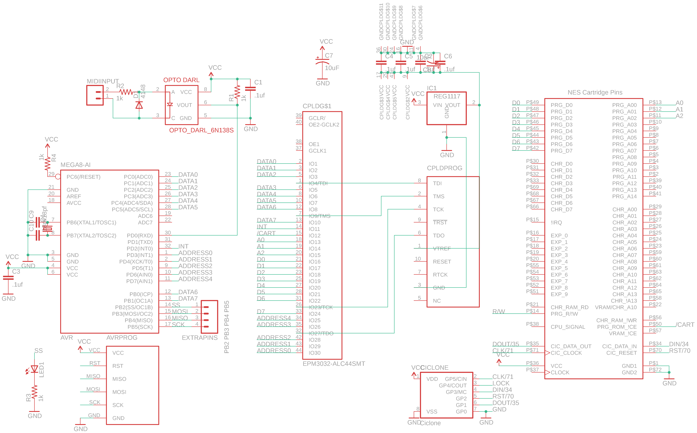
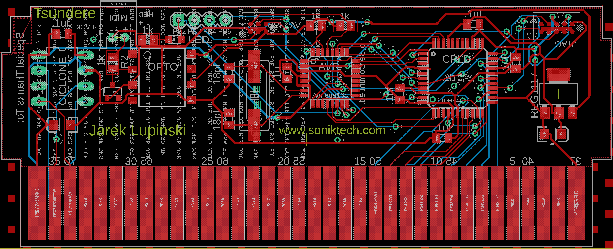
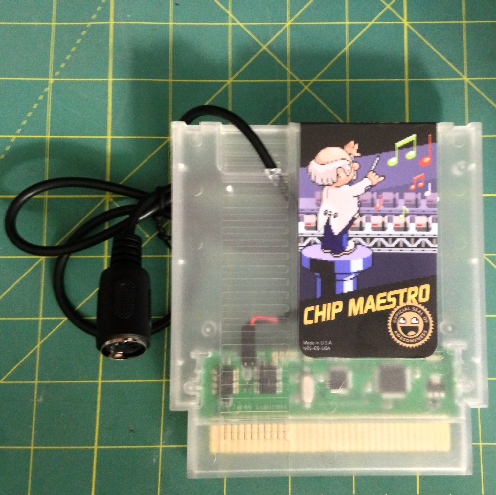

# chip-maestro
An NES Cartridge with a MIDI Input Jack

After watching Anamanaguchi play a live show with a NES MIDI Tracker, I wanted to create a live instrument they could play on-stage.

It's been a while since I worked on this. I'm sorry about the CPLD part, it was a good idea then but now it would desperately need an update, probably to one of those microcontrollers with built-in configurable logic blocks.

